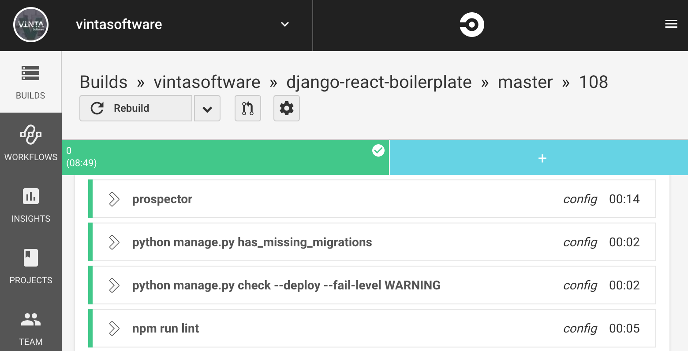

# Python Linters and Code Analysis tools curated list
A curated list made for the DjangoCon US talk ["Preventing headaches with linters and automated checks"](https://2017.djangocon.us/talks/preventing-headaches-with-linters-and-automated-checks/) by [Flávio Juvenal](https://twitter.com/flaviojuvenal).

Feel free to contribute! Happy to receive PRs.

## Linters
* Wrappers:
    * Coala - Wrapper of code linters and fixers for various languages, including Python. Written in Python. Wraps [all popular Python linters](https://github.com/coala/coala-bears/tree/master/bears/python):
    [https://coala.io/](https://coala.io/)
        * bandit, isort, mypy, pycodestyle, pydocstyle, pyflakes, pylint, pyroma, radon, vulture, yapf
        * also, has exclusive checks:
            * PEP8 for Jupyter notebooks:
            [https://github.com/coala/coala-bears/blob/master/bears/python/PEP8NotebookBear.py](https://github.com/coala/coala-bears/blob/master/bears/python/PEP8NotebookBear.py)
            * `__init__.py` checker:
            [https://github.com/coala/coala-bears/blob/master/bears/python/PythonPackageInitBear.py](https://github.com/coala/coala-bears/blob/master/bears/python/PythonPackageInitBear.py)
    * Yala - [https://github.com/cemsbr/yala](https://github.com/cemsbr/yala):
        * Wraps the **latest** versions of: flake8, isort, pycodestyle, pydocstyle, pyflakes, pylint, radon
        * Configure all linters in setup.cfg, even pylint.
    * prospector - Primary aim of Prospector is to be useful 'out of the box'. Wraps the [following tools](https://prospector.landscape.io/en/master/supported_tools.html):
    [https://github.com/PyCQA/prospector](https://github.com/PyCQA/prospector)
        * dodgy, frosted, mccabe, pycodestyle, pydocstyle, pyflakes, pylint, pyroma, vulture
    * Pylama - Wraps the following tools:
    [https://pylama.readthedocs.io/en/latest/](https://pylama.readthedocs.io/en/latest/)
        * mccabe, pycodestyle, pydocstyle, pyflakes, pylint, radon
    * Ciocheck - Wraps the following tools:
    [https://github.com/ContinuumIO/ciocheck](https://github.com/ContinuumIO/ciocheck)
        * autopep8, flake8, isort, pep8, pydocstyle, pylint, pytest-cov, yapf
    * wemake-python-styleguide - Wraps the following tools: 
    [https://github.com/wemake-services/wemake-python-styleguide](https://github.com/wemake-services/wemake-python-styleguide)
        * flake8, flake8-bugbear, eradicate, isort, mccabe, jones-complexity, and many other flake8 plugins

* General:
    * **flake8** - Wrapper around pyflakes, pycodestyle and mccabe. Considered a single tool here because it's **a must for every Python project to use those tools combined**. Also, it augments pyflakes and mccabe with [error codes](https://pycodestyle.readthedocs.io/en/latest/intro.html#error-codes). [https://github.com/PyCQA/flake8](https://github.com/PyCQA/flake8)
        * [https://github.com/PyCQA/pyflakes](https://github.com/PyCQA/pyflakes)
        * [https://github.com/PyCQA/pycodestyle](https://github.com/PyCQA/pycodestyle)
        * [https://github.com/PyCQA/mccabe](https://github.com/PyCQA/mccabe)
    * pylint - Most intelligent Python linter. It's able to infer a lot using only static analysis, thereby finding subtle bugs. However, [it's criticized for unfriendly defaults](https://codewithoutrules.com/2016/10/19/pylint/):
    [https://github.com/PyCQA/pylint](https://github.com/PyCQA/pylint)
    * flake8-bugbear - A plugin for flake8 finding likely bugs and design problems in your program. Contains warnings that don't belong in pyflakes and pycodestyle:
    [https://github.com/PyCQA/flake8-bugbear](https://github.com/PyCQA/flake8-bugbear)
    * vulture - Find dead code:
    [https://pypi.python.org/pypi/vulture](https://pypi.python.org/pypi/vulture)
    * pydiatra - Yet another static checker for Python code:
    [http://jwilk.net/software/pydiatra](http://jwilk.net/software/pydiatra)
    * redbaron-missing-comma-string-collection - Warns about missing commas in Python string collections:
    [https://github.com/razzius/redbaron-missing-comma-string-collection](https://github.com/razzius/redbaron-missing-comma-string-collection)
    * inspectortiger - A modern automated Python code review tool which warns you about improvable code and possible bugs:
    [https://github.com/thg-consulting/inspectortiger](https://github.com/thg-consulting/inspectortiger)
* Typing:
    * mypy - Mypy is an experimental optional static type checker for Python that aims to combine the benefits of dynamic (or "duck") typing and static typing. Has type inference capabilities. Maybe it's the future of Python for larger projects:
    [http://mypy-lang.org/](http://mypy-lang.org/)
    * pyre - Pyre is a performant type checker for Python from Facebook: [https://pyre-check.org/](https://pyre-check.org/)
* Imports ordering:
    * isort - A Python utility / library to sort imports or check them: [https://github.com/timothycrosley/isort](https://github.com/timothycrosley/isort)
    * flake8-import-order - Flake8 plugin that checks import order against various Python Style Guides:
    [https://github.com/PyCQA/flake8-import-order](https://github.com/PyCQA/flake8-import-order)
    * flake8-mypy - A plugin for Flake8 integrating mypy. To use in editors and other tools that already support Flake8 warning syntax and config:
    [https://github.com/ambv/flake8-mypy](https://github.com/ambv/flake8-mypy)
* Naming:
    * pep8-naming - Naming Convention checker for Python:
    [https://github.com/PyCQA/pep8-naming](https://github.com/PyCQA/pep8-naming)
* Circular imports:
    * pycycle - Tool for pinpointing circular imports in Python:
    [https://github.com/bndr/pycycle](https://github.com/bndr/pycycle)
* Documentation:
    * pydocstyle - Docstring style checker:
    [https://github.com/PyCQA/pydocstyle](https://github.com/PyCQA/pydocstyle)
* Packaging:
    * pipenv check - Asserts that PEP 508 requirements are being met by the current environment:
    [https://github.com/kennethreitz/pipenv](https://github.com/kennethreitz/pipenv)
    * pyroma - Test your project's packaging friendliness:
    [https://pypi.python.org/pypi/pyroma/](https://pypi.python.org/pypi/pyroma/)
    * check-manifest - Tool to check the completeness of MANIFEST.in for Python packages:
    [https://github.com/mgedmin/check-manifest](https://github.com/mgedmin/check-manifest)
* Security:
    * **safety** - Checks your installed dependencies for known security vulnerabilities. **A must for every Python project**: [https://github.com/pyupio/safety](https://github.com/pyupio/safety)
    * **bandit** - Python AST-based static analyzer from OpenStack Security Group. **A must for every Python project**:
    [https://github.com/PyCQA/bandit](https://github.com/PyCQA/bandit)
    * **dodgy** - Looks at Python code to search for things which look "dodgy" such as passwords or diffs. **A must for every Python project**:
    [https://github.com/landscapeio/dodgy](https://github.com/landscapeio/dodgy)
    * dlint - Tool for encouraging best coding practices and helping to ensure secure Python code: [https://github.com/duo-labs/dlint](https://github.com/duo-labs/dlint)
    * dependency-check - Shim to easily install OWASP dependency-check-cli into Python projects: [https://pypi.python.org/pypi/dependency-check/](https://pypi.python.org/pypi/dependency-check/)
    * pyt - A Static Analysis Tool for Detecting Security Vulnerabilities in Python Web Applications:
    [https://github.com/python-security/pyt](https://github.com/python-security/pyt)
    * python-afl - American fuzzy lop fork server and instrumentation for pure-Python code:
    [https://github.com/jwilk/python-afl](https://github.com/jwilk/python-afl)
* CPython:
    * cpychecker - a static analysis tool for CPython extension code: [https://gcc-python-plugin.readthedocs.io/en/latest/cpychecker.html](https://gcc-python-plugin.readthedocs.io/en/latest/cpychecker.html)
* Code complexity:
    * mccabe - McCabe complexity checker for Python:
    [https://github.com/PyCQA/mccabe](https://github.com/PyCQA/mccabe)
    * radon - Radon is a Python tool that computes various metrics from the source code:
    [https://github.com/rubik/radon](https://github.com/rubik/radon)
    * xenon - It monitors your code's complexity using radon. Ideally, Xenon is run every time you commit code. Through command line options, you can set various thresholds for the complexity of your code:
    [https://github.com/rubik/xenon](https://github.com/rubik/xenon)
* Spell-checker (for code):
    * scspell3k - Spell checker for source code: [https://pypi.python.org/pypi/scspell3k](https://pypi.python.org/pypi/scspell3k)
* Django-specific checks:
    * pylint-django - Pylint plugin for improving code analysis for when using Django:
    [https://github.com/landscapeio/pylint-django](https://github.com/landscapeio/pylint-django)
    * pylint-celery - Pylint plugin for analysing code using Celery:
    [https://github.com/landscapeio/pylint-celery](https://github.com/landscapeio/pylint-celery)
    * pyup-django - Displays a red warning banner if you are running an insecure Django release:
    [https://github.com/pyupio/pyup-django](https://github.com/pyupio/pyup-django)
    * mypy-django - PEP-484 type hints bindings for the Django web framework:
    [https://github.com/machinalis/mypy-django](https://github.com/machinalis/mypy-django)
    * django-vitals - A Django app that provides health check endpoints for vital services:
    [https://github.com/LCOGT/django-vitals](https://github.com/LCOGT/django-vitals)
    * django-lint - Tool to lint Django applications and projects:
    [https://github.com/lamby/django-lint](https://github.com/lamby/django-lint)
* Testing:
    * flake8-asserts - Flake8 plugin that enforces use of unittest's rich asserts:
    [https://github.com/stephenfin/flake8-asserts](https://github.com/stephenfin/flake8-asserts)
* Pylint plugins:
    * Django/Celery:
        * [https://github.com/landscapeio/pylint-django](https://github.com/landscapeio/pylint-django)
        * [https://github.com/landscapeio/pylint-celery](https://github.com/landscapeio/pylint-celery)
    * Werkzeug:
        * [https://github.com/jschaf/pylint-werkzeug](https://github.com/jschaf/pylint-werkzeug)
    * Odoo:
        * [https://github.com/OCA/pylint-odoo](https://github.com/OCA/pylint-odoo)
    * PeeWee:
        * [https://github.com/hjc/pylint-peewee](https://github.com/hjc/pylint-peewee)
    * Internationalization (i18n):
        * [https://github.com/rory/python-pylint-i18n](https://github.com/rory/python-pylint-i18n)
    * Sentry:
        * [https://github.com/davidszotten/sentry-stack-checker](https://github.com/davidszotten/sentry-stack-checker)
    * Quotes:
        * [https://github.com/edaniszewski/pylint-quotes](https://github.com/edaniszewski/pylint-quotes)
    * Plugins made by orgs for their projects:
        * [https://github.com/twisted/twistedchecker](https://github.com/twisted/twistedchecker)
        * [https://github.com/openstack-dev/hacking](https://github.com/openstack-dev/hacking)
        * [https://github.com/edx/edx-lint](https://github.com/edx/edx-lint)
        * [https://github.com/saltstack/salt-pylint](https://github.com/saltstack/salt-pylint)
        * [https://github.com/qutebrowser/qutebrowser/tree/master/scripts/dev/pylint_checkers/qute_pylint](https://github.com/qutebrowser/qutebrowser/tree/master/scripts/dev/pylint_checkers/qute_pylint)

## When to run linters
* programming-time
    * Check your IDE extensions
* commit-time
    * pre-commit - Run checks automatically before git commits:
    [http://pre-commit.com/](http://pre-commit.com/)
* CI-time
    * Configure linters to run on CI-time, like [vintasoftware/django-react-boilerplate](https://github.com/vintasoftware/django-react-boilerplate) does. Here's an example of a CI run with some linters:
    
* Code review-time
    * linty_fresh - Surface lint errors during code review: [https://github.com/lyft/linty_fresh](https://github.com/lyft/linty_fresh)
    * inline-plz-bot - Lints your Pull Requests and comments inline on the diffs:
    [https://github.com/guykisel/inline-plz-bot](https://github.com/guykisel/inline-plz-bot)
    * imhotep - Imhotep is a tool which will comment on commits coming into your repository and check for syntactic errors and general lint warnings:
    [https://github.com/justinabrahms/imhotep](https://github.com/justinabrahms/imhotep)
    * lint-review - An automated code linting bot that integrates various code lint tools with github pull requests:
    [https://github.com/markstory/lint-review](https://github.com/markstory/lint-review)

## Fixers
* General:
    * **black** - Most accepted auto-formatter for Python that follows a strict subset of PEP 8. Used by Django and requests. **A must for every Python project**: https://github.com/psf/black
    * autoflake - autoflake removes unused imports and unused variables from Python code:
    [https://github.com/myint/autoflake](https://github.com/myint/autoflake)
    * autopep8 - A tool that automatically formats Python code to conform to the PEP 8 style guide:
    [https://github.com/hhatto/autopep8](https://github.com/hhatto/autopep8)
    * yapf - A formatter for Python files:
    [https://github.com/google/yapf](https://github.com/google/yapf)
* Imports ordering:
    * isort - A Python utility / library to sort imports or check them: [https://github.com/timothycrosley/isort](https://github.com/timothycrosley/isort)
* Imports removing
   * [Unimport - A linter, formatter for finding and removing unused import statements](https://github.com/hakancelik96/unimport)

## AST tools
* AST manipulation:
    * [https://docs.python.org/3/library/ast.html](https://docs.python.org/3/library/ast.html)
        * Better documentation for AST module: [https://greentreesnakes.readthedocs.io/en/latest/](https://greentreesnakes.readthedocs.io/en/latest/)
    * [https://github.com/python/typed_ast](https://github.com/python/typed_ast)
    * [https://github.com/davidhalter/parso](https://github.com/davidhalter/parso)
    * [https://github.com/berkerpeksag/astor](https://github.com/berkerpeksag/astor)
    * [https://github.com/simonpercivall/astunparse](https://github.com/simonpercivall/astunparse)
    * [https://github.com/mbdevpl/typed-astunparse](https://github.com/mbdevpl/typed-astunparse)
    * [https://github.com/pgbovine/python-parse-to-json](https://github.com/pgbovine/python-parse-to-json)
* Compatibility for different Python versions and implementations:
    * [https://github.com/almarklein/commonast](https://github.com/almarklein/commonast)
    * [https://github.com/serge-sans-paille/gast](https://github.com/serge-sans-paille/gast)
* Eval:
    * [https://github.com/newville/asteval/](https://github.com/newville/asteval/)
* Visualization:
    * [https://github.com/titusjan/astviewer](https://github.com/titusjan/astviewer)
    * [https://github.com/quantifiedcode/python-ast-visualizer](https://github.com/quantifiedcode/python-ast-visualizer)

## Refactoring tools
* eradicate - Removes commented-out code:
[https://pypi.python.org/pypi/eradicate](https://pypi.python.org/pypi/eradicate)
* baron - IDE allow you to refactor code, Baron allows you to write refactoring code:
[https://github.com/PyCQA/baron](https://github.com/PyCQA/baron)
* redbaron - Bottom-up approach to refactoring in python: [https://github.com/pycqa/redbaron](https://github.com/pycqa/redbaron)
* debtcollector - A collection of Python deprecation patterns and strategies that help you collect your technical debt in a non-destructive manner: [https://pypi.python.org/pypi/debtcollector](https://pypi.python.org/pypi/debtcollector)
* Raincoat - Raincoat has you covered when you can't stay DRY: [https://github.com/novafloss/raincoat](https://github.com/novafloss/raincoat)

## Other tools
* Requirements Detector - attempts to find and list the requirements of a Python project:
[https://github.com/landscapeio/requirements-detector](https://github.com/landscapeio/requirements-detector)
* pytype - Pytype is a static type inferencer for Python code. Outputs type annotations which can be merged into code with [merge_pyi](https://github.com/google/merge_pyi). More info [here](https://lwn.net/Articles/690150/):
[https://github.com/google/pytype](https://github.com/google/pytype)
* retype - Re-apply type annotations from .pyi stubs to your codebase:
[https://github.com/ambv/retype](https://github.com/ambv/retype)
* typycal - Generate type stubs from runtime type information, ideally by running unit tests
[http://ethanhs.me/blog/typycal.html](http://ethanhs.me/blog/typycal.html)
* dependenpy - Scan your code to build a dependency matrix for a set of Python packages,
  than you can use for further analysis: [https://github.com/pawamoy/dependenpy](https://github.com/pawamoy/dependenpy)

## Inactive projects
* From any section above:
    * [https://github.com/timothycrosley/frosted](https://github.com/timothycrosley/frosted)
    * [http://clonedigger.sourceforge.net/index.html](http://clonedigger.sourceforge.net/index.html)
    * [https://github.com/jschaf/pylint-flask](https://github.com/jschaf/pylint-flask)
    * [https://github.com/ipmb/PyMetrics](https://github.com/ipmb/PyMetrics)
    * [https://github.com/euske/pyntch/](https://github.com/euske/pyntch/)
    * [https://github.com/uber/py-find-injection](https://github.com/uber/py-find-injection)
    * [https://github.com/lambdalabdesigner/pysonar2](https://github.com/lambdalabdesigner/pysonar2)
    * [https://github.com/spulec/pep8ify](https://github.com/spulec/pep8ify)
    * [http://euske.github.io/pyntch/index.html](http://euske.github.io/pyntch/index.html)

## Sources
* Original research
* [Awesome Static Analysis](https://github.com/mre/awesome-static-analysis#python)
* [This list](https://github.com/jwilk/check-all-the-things/blob/df538fd180d62bdd1c5bc1b28d1d63bb5ed2d952/data/python.ini)
